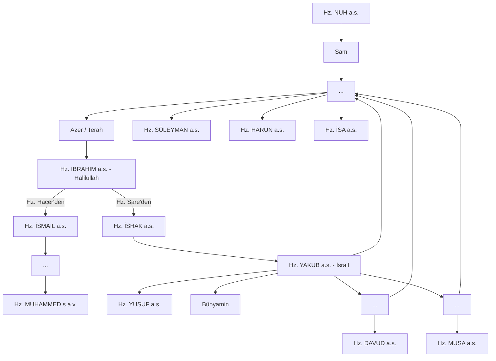

# İbrahim Ailesi Soy Ağacı: Nübüvvetin Kökenleri

Millet-i İbrahim, rastgele bir topluluk değil, Allah tarafından seçilmiş ve birbiri ardınca gelen peygamberlerle onurlandırılmış kutsal bir silsiledir.

## Temel Silsile

## Soy Ağacının Teolojik Önemi

1. **Vahyin Birliği:** Tüm bu peygamberlerin aynı kökten gelmesi, getirdikleri mesajın da (İslam/Tevhid) bir olduğunu kanıtlar.
2. **Duânın Tecellisi:** Hz. İbrahim'in "Rabbim, soyumdan namazı kılanlar eyle" duasının binlerce yıl süren bir berekete dönüşmesi.
3. **Millet-i İbrahim Kavramı:** Bu soy ağacı sadece biyolojik değildir. İbrahim'in (a.s.) iman yoluna giren herkes, manevi olarak bu ağacın bir dalıdır.

---

## Kur'ani Referanslar
- "Şüphesiz Allah; Âdem'i, Nûh'u, İbrahim ailesini ve İmrân ailesini birbirinin soyundan olarak alemlere üstün kıldı." (Âl-i İmrân, 33-34)
