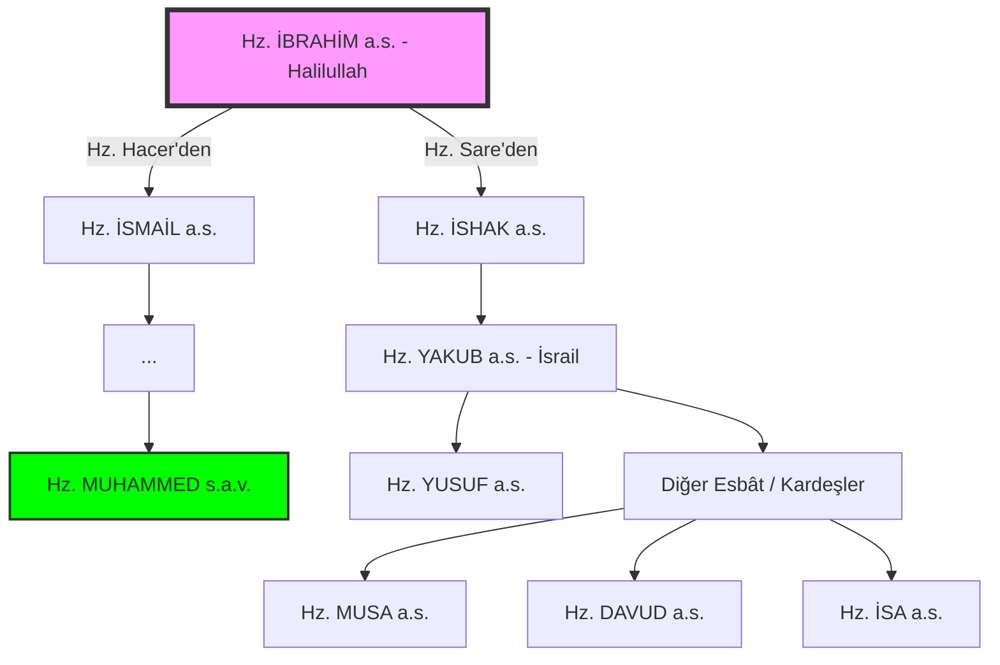

# İbrahim Ailesi Soy Ağacı: Nübüvvetin Kökenleri

Millet-i İbrahim, rastgele bir topluluk değil, Allah tarafından seçilmiş ve birbiri ardınca gelen peygamberlerle onurlandırılmış kutsal bir silsiledir.

> [!IMPORTANT]
> ** إِنَّ اللَّهَ اصْطَفَىٰ آدَمَ وَنُوحًا وَآلَ إِبْرَاهِيمَ وَآلَ عِمْرَانَ عَلَى الْعَالَمِينَ (33) ذُرِّيَّةً بَعْضُهَا مِن بَعْضٍ ۗ وَاللَّهُ سَمِيعٌ عَلِيمٌ** (34)
> 
> *"Şüphesiz Allah; Âdem'i, Nûh'u, İbrahim ailesini ve İmrân ailesini birbirinin soyundan olarak alemlere üstün kıldı. Allah hakkıyla işitendir, hakkıyla bilendir."* (Âl-i İmrân, 33-34)

## Şematik Silsile

Aşağıdaki şema, Hz. İbrahim'den başlayarak iki büyük kol üzerinden (İsmail ve İshak) devam eden peygamberlik zincirini göstermektedir:

## Soy Ağacının Teolojik Önemi

1. **Vahyin Birliği:** Tüm bu peygamberlerin aynı kökten gelmesi, getirdikleri mesajın da (İslam/Tevhid) bir olduğunu kanıtlar.
2. **Duânın Tecellisi:** Hz. İbrahim'in "Rabbim, soyumdan namazı kılanlar eyle" duasının binlerce yıl süren bir berekete dönüşmesi.
3. **Millet-i İbrahim Kavramı:** Bu soy ağacı sadece biyolojik değildir. İbrahim'in (a.s.) iman yoluna giren herkes, manevi olarak bu ağacın bir dalıdır.

---

## Başvuru Notları
- **İbn Kesir:** *el-Bidâye ve'n-Nihâye*, Peygamberler tarihi cildi.
- **Taberi:** *Tarihü'l-Ümem ve'l-Mülük*.
