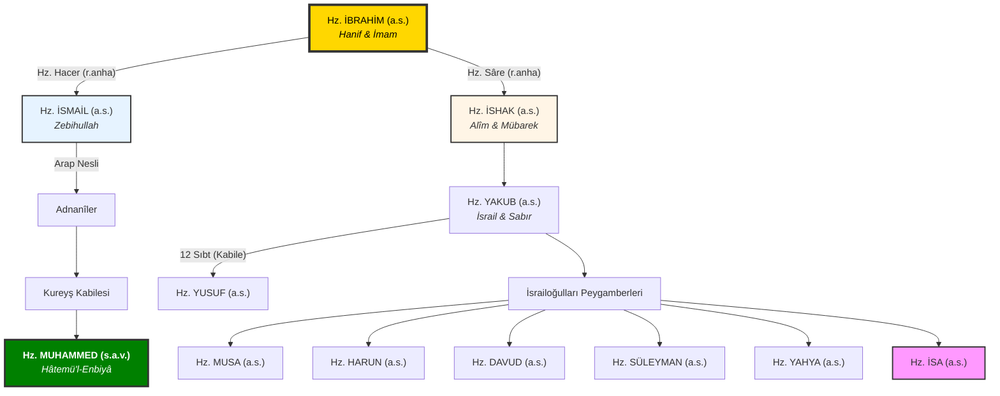

# İbrahim Ailesi Soy Ağacı: Nübüvvetin ve Hidayetin Altın Zinciri

Millet-i İbrahim, rastgele bir topluluk değil; Allah tarafından seçilmiş, arındırılmış ve birbiri ardınca gelen peygamberlerle onurlandırılmış kutsal bir **"Hidayet Silsilesi"**dir. Bu soy ağacı, sadece biyolojik bir nesli değil, Tevhid bayrağının elden ele devredildiği bir inanç atlasını temsil eder.

> [!IMPORTANT]
> **إِنَّ اللَّهَ اصْطَفَىٰ آدَمَ وَنُوحًا وَآلَ إِبْرَاهِيمَ وَآلَ عِمْرَانَ عَلَى الْعَالَمِينَ (33) ذُرِّيَّةً بَعْضُهَا مِن بَعْضٍ ۗ وَاللَّهُ سَمِيعٌ عَلِيمٌ** (34)
> 
> *"Şüphesiz Allah; Âdem'i, Nûh'u, İbrahim ailesini ve İmrân ailesini birbirinin soyundan olarak alemlere üstün kıldı. Allah hakkıyla işitendir, hakkıyla bilendir."* (Âl-i İmrân, 33-34)

## Şematik Silsile: İki Büyük Kol

Aşağıdaki şema, Hz. İbrahim'den (a.s.) başlayarak iki ana koldan (Mekke/Hicaz ve Kenan/Filistin) devam eden ve nihayetinde insanlığın son rehberi Hz. Muhammed Mustafa (s.a.v.) ile kemale eren hidayet zincirini göstermektedir:

## Soy Ağacının Teolojik ve Sosyolojik Önemi

### 1. "Zürriyyeten Ba'duhâ min Ba'd" Sırrı
Âl-i İmrân 34. ayette geçen bu ifade, bu soyun tesadüfi olmadığını; ahlaki, manevi ve biyolojik olarak bir "saflık" silsilesi olduğunu anlatır. Onlar birbirlerinin hem maddi hem de manevi mirasçılarıdır.

### 2. Mekke ve Kudüs Hattı: Tevhidin İki Merkezi
- **Hz. İsmail Kolu:** Tevhidin kıblesi Kâbe'yi inşa etmiş ve son peygamberin gelmesiyle bu davayı evrensele taşımıştır.
- **Hz. İshak Kolu:** Binlerce yıl boyunca Kenan ve Mısır bölgesinde vahyin kurumsallaşmasını (Şeriat) ve peygamberlik müessesesinin sürekliliğini sağlamıştır.

### 3. Duânın Bin Yıllık Yankısı
Hz. İbrahim'in (a.s.) Bakara 127-129. ayetlerde yaptığı: **"Rabbimiz! Onlara içlerinden senin ayetlerini okuyacak bir elçi gönder..."** duası; asırlar sonra Hz. Muhammed (s.a.v.) ile tecelli etmiştir. Bu ağaç, bir duanın filizlenmiş halidir.

## Millet-i İbrahim: Manevi Neseb
Kur'an-ı Kerim, peygamber ailesine mensup olmanın tek başına kurtuluş olmadığını (Hz. Nuh'un oğlu veya Hz. Lut'un karısı örneğinde olduğu gibi) hatırlatır. Gerçek "soy", **iman bağıdır**. Bu sebeple Hz. İbrahim'in yoluna giren her mümin, manevi olarak bu ağacın bir dalı ve bu hidayet silsilesinin bir parçası kabul edilir.

---

## Kaynakça ve Notlar
- **İmam Taberî:** *Tarihü'l-Ümem ve'l-Mülük* (Peygamberlerin soy bilgileri üzerine en temel eser).
- **İbn Kesîr:** *el-Bidâye ve'n-Nihâye* (Peygamberlerin hayatı ve silsile detayları).
- **Zemahşerî:** *Keşşâf* (Âl-i İmrân 33-34 tefsiri).

---
[Ana Sayfaya Dön](../README.md)
