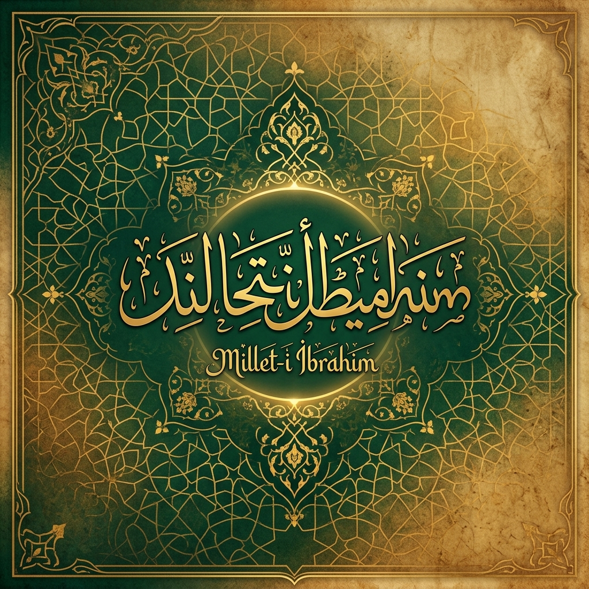
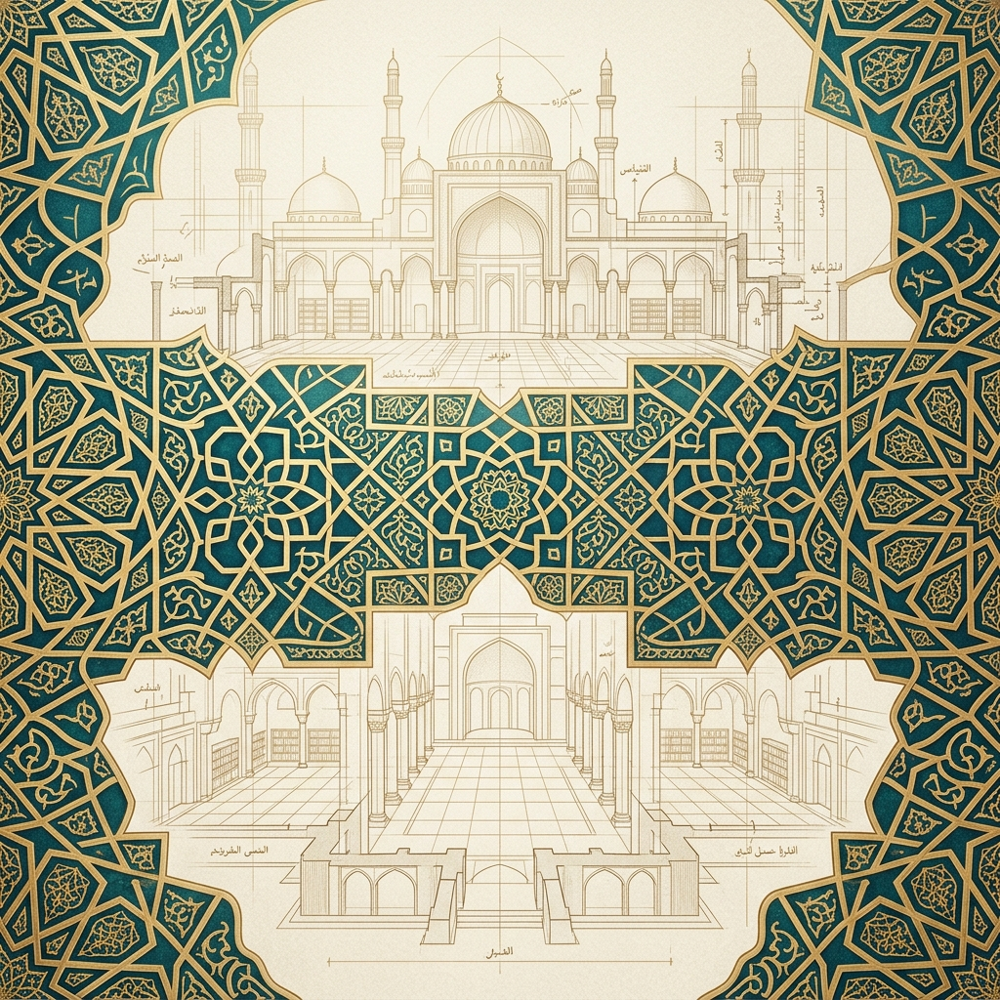
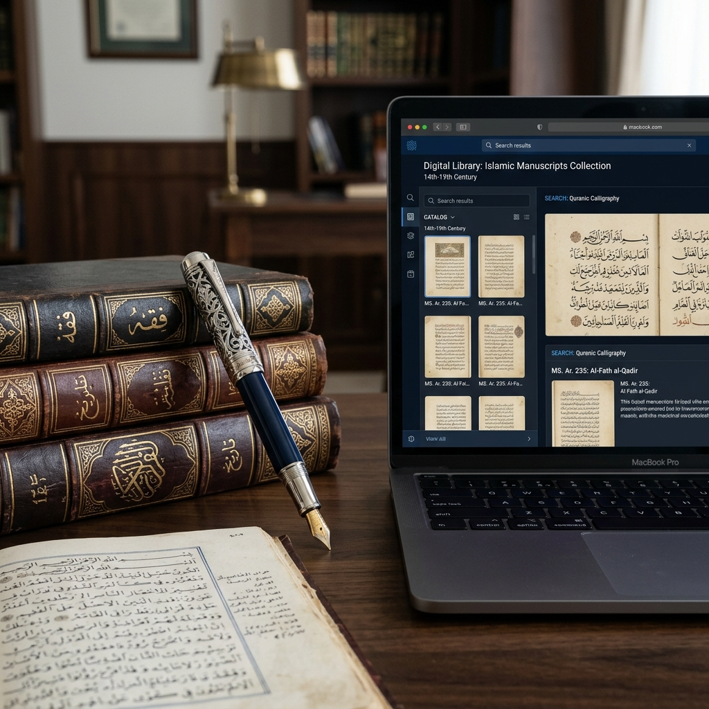

# Millet-i İbrahim: Tevhidin Sarsılmaz Silsilesi

> [!IMPORTANT]
> **وَأَنْ أَقِمْ وَجْهَكَ لِلدِّينِ حَنِيفًا وَلَا تَكُونَنَّ مِنَ الْمُشْرِكِينَ**
> 
> *"Gökleri ve yeri birleyerek (hanîf olarak) yüzünü o dine çevir ve sakın müşriklerden olma."* (Yunus, 105)

---

## 🏛 Projenin Vizyonu ve Felsefesi

**Millet-i İbrahim**, sadece tarihsel bir topluluğu değil; zamanın ve mekanın ötesinde, insanlığın fıtratına nakşedilmiş **"Saf Hakikat"** arayışını temsil eder. Kur'an-ı Kerim, tarihsel kıssaları yalnızca geçmişin bir anlatısı olarak değil, her çağdaki insana yön veren evrensel ilkeler (sünnetullah) olarak sunar.

Hz. İbrahim'in (a.s.) ateşe atılma pahasına savunduğu bu tevhid meşalesi, Allah'ın bir lütfu olarak ona bağışlanan oğlu Hz. İshak ve torunu Hz. Yakub (a.s.) ile kesintisiz bir **"nübüvvet ve hidayet silsilesine"** dönüşmüştür. Sâd Suresi 45. ayette geçen **"Kuvvetli ve basiretli kullarımız..."** hitabı, bu üç şahsiyetin irade (kuvvet) ve hakikati görme (basiret) konusundaki eşsiz konumlarını özetler.

### 🌟 Nübüvvet Silsilesinin Hikmeti
İbrahimî gelenek, bireysel bir dindarlıktan ziyade **"ailevi ve toplumsal bir süreklilik"** inşa eder. Bu silsilede;
- **İbrahim (a.s.):** Kurucu iradeyi ve mutlak teslimiyeti,
- **İshak (a.s.):** İlmi derinliği ve mübarek bir neslin devamını,
- **Yakub (a.s.):** Sabrı, vasiyet disiplinini ve kurumsal kimlik (İsrail) bilincini temsil eder.

---

## 🔍 Temel Kavramların Etimolojik Analizi

Arşivimizde her kavram, Kur'an'ın semantik dünyasındaki köklerine inilerek incelenir:

1.  **Millet (مِلَّة):** Kelime anlamı itibarıyla "izlenen yol, din, şeriat" demektir. Ancak "Millet-i İbrahim" tabiri, pasif bir aidiyetten ziyade, bilinçli bir **"yol takibi"** ve **"fikri duruş"** anlamına gelir.
2.  **Hanîf (حَنِيف):** Eğriliği bırakıp doğruya yönelen, her türlü şirkten yüz çevirip tek olan Allah'a ihlasla bağlanan demektir. İbrahimî yolun "genetik kodu" Hanifliktir.
3.  **İmâm (إِمَام):** Önder, rehber, numune-i imtisal. Bakara 124. ayette Hz. İbrahim'e verilen bu unvan, onun tüm insanlık için bir "referans noktası" kılındığını tesciller.

---

## 🗂️ Depo Mimarisi ve İçerik Rehberi

Arşivdeki bilgilere hızlı erişim sağlamak için yapılandırılmış dizin yapısı aşağıdadır:

### 📂 [01 Ayet Analizleri](01_ayet_analizleri/)
*Kilit ayetlerin kelime kelime tefsiri ve nüzul bağlamı.*
- 📝 [Kuvvet ve Basiret](01_ayet_analizleri/sad_45_47_kuvvet_ve_basiret.md) (Sâd 45-47)
- 📝 [Lisan-ı Sıdk](01_ayet_analizleri/meryem_49_50_lisan_i_sidk.md) (Meryem 49-50)
- 📝 [Peygamberlerin Vasiyeti](01_ayet_analizleri/bakara_132_133_vasiyet.md) (Bakara 132-133)
- 📝 [Hidayet Silsilesi](01_ayet_analizleri/enam_84_hidayet_ve_lisan.md) (En'âm 84)
- 📝 [Ataların Dini](01_ayet_analizleri/yusuf_38_atalarin_dini.md) (Yusuf 38)
- 📝 [Hidayet Rehberleri](01_ayet_analizleri/sad_48_hidayet_rehberleri.md) (Sâd 48)

### 📂 [02 Kavramsal Çerçeve](02_kavramsal_cerceve/)
*İbrahimî geleneğin üzerine inşa edildiği temel sütunlar.*
- 🧩 [Haniflik Nedir?](02_kavramsal_cerceve/haniflik_nedir.md)
- 🧩 [İmamet ve Önderlik](02_kavramsal_cerceve/imamet_ve_onderlik.md)
- 🧩 [Vasiyet Kavramı](02_kavramsal_cerceve/vasiyet_kavrami.md)
- 🧩 [Lisan-ı Sıdk (Doğruluk Dili)](02_kavramsal_cerceve/lisan_i_sidk_dogruluk_dili.md)
- 🧩 [Kalb-i Selîm](02_kavramsal_cerceve/kalb_i_selim.md)
- 🧩 [İhlas ve Ahiret Yurdu](02_kavramsal_cerceve/ihlas_ve_ahiret_yurdu.md)
- 🧩 [İsrail İsminin Anlamı](02_kavramsal_cerceve/israil_isminin_anlami.md)

### 📂 [03 Peygamber Profilleri](03_peygamber_profilleri/)
*Şahsiyetlerin Kur'anî vasıfları ve karakter analizleri.*
- 👤 [Hz. İbrahim (a.s.) - Halilullah](03_peygamber_profilleri/ibrahim_as_halilullah.md)
- 👤 [Hz. İshak (a.s.) - Alîm ve Mübarek](03_peygamber_profilleri/ishak_as_ulim_ve_mubarek.md)
- 👤 [Hz. Yakub (a.s.) - İsrail ve Sabır](03_peygamber_profilleri/yakub_as_israil_ve_sabir.md)

### 📂 [04 Şecere ve Tarih](04_secere_ve_tarih/)
*Tarihsel kronoloji ve soy ağacı çalışmaları.*
- 🌳 [İbrahim Ailesi Soy Ağacı](04_secere_ve_tarih/ibrahim_ailesi_soy_agaci.md)
- 📍 [Tevhidin Coğrafyası ve Hicret](04_secere_ve_tarih/tevhidin_cografyasi.md)

### 📂 [05 Kaynakça ve Tefsirler](05_kaynakca_ve_tefsirler/)
*Arşivin beslendiği akademik ve ilmi kaynaklar.*
- 📚 [Başvuru Eserleri](05_kaynakca_ve_tefsirler/basvuru_eserleri.md)

### 📂 [06 Vecizeler ve İktibaslar](06_vecizeler_ve_iktibaslar/)
*İslam alimlerinin ve mutasavvıfların İbrahimî yol yorumları.*
- 📜 [Âlimlerin Dilinden İbrahimî Yol](06_vecizeler_ve_iktibaslar/alimlerin_dilinden_ibrahimi_yol.md)
- 🌍 [Evrensel Perspektif ve Felsefe](06_vecizeler_ve_iktibaslar/evrensel_perspektif_ve_felsefi_yaklasimlar.md)
- 📖 [Ehl-i Kitap Gözüyle İbrahimî Gelenek](06_vecizeler_ve_iktibaslar/ehl_i_kitap_gozuyle_ibrahimi_gelenek.md)

## 💎 Odak Noktaları (Millet-i İbrahim'in Sütunları)

Millet-i İbrahim'in sarsılmaz silsilesini tanımlayan ve bu arşivin temelini oluşturan üç ana ruh:

> [!NOTE]
> ### 1. Kuvvet ve Basiret (Sâd Suresi 45-48)
> **وَاذْكُرْ عِبَادَنَآ اِبْرٰه۪يمَ وَاِسْحٰقَ وَيَعْقُوبَ اُولِي الْاَيْد۪ي وَالْاَبْصَارِۜ**
> 
> *"Güçlü ve basiretli kullarımız İbrahim’i, İshak’ı ve Yakub’u da an."* (Sâd, 45)
> 
> Ayet-i kerimede geçen **"Evli'l-eydi"** (eller/kuvvet sahipleri) tabiri, bu üç peygamberin ibadetlerdeki kararlılığını, dini yaşamadaki sarsılmaz iradesini ve zorluklar karşısındaki metanetini ifade eder. **"Evli'l-ebsâr"** (gözler/basiret sahipleri) ise, eşyanın hakikatini görme, ilahi hikmetleri kavrama ve körü körüne bir taklitten uzak durma yetisidir. İbrahimî yol; sadece eylem değil, derin bir kavrayış yoludur.

> [!NOTE]
> ### 2. Vasiyet Geleneği (Bakara Suresi 132-134)
> **وَوَصّٰى بِهَآ اِبْرٰه۪يمُ بَن۪يهِ وَيَعْقُوبُۜ يَا بَنِيَّ اِنَّ اللّٰهَ اصْطَفٰى لَكُمُ الدّ۪ينَ فَلَا تَمُوتُنَّ اِلَّا وَاَنْتُمْ مُسْلِمُونَۜ**
> 
> *"İbrahim bunu kendi oğullarına da vasiyet etti, Yakub da: 'Oğullarım! Allah sizin için bu dini seçti, siz de ancak müslümanlar olarak ölün' dedi."* (Bakara, 132)
> 
> Hz. İbrahim ve torunu Hz. Yakub, vefat anında çocuklarına mal, mülk veya taht değil; en büyük sermaye olan **"İslam üzere kalmayı"** vasiyet etmişlerdir. Bu vasiyet, Millet-i İbrahim'in nesiller arası kesintisiz bir hidayet köprüsü kurduğunun en büyük kanıtıdır. Arşivimiz, bu manevi mirasın günümüze nasıl taşınması gerektiğini inceler.

> [!NOTE]
> ### 3. Lisan-ı Sıdk / Doğruluk Dili (Meryem Suresi 50)
> **وَوَهَبْنَا لَهُمْ مِنْ رَحْمَتِنَا وَجَعَلْنَا لَهُمْ لِسَانَ صِدْقٍ عَلِيًّا**
> 
> *"Onlara rahmetimizden bağışta bulunduk ve kendileri için yüce bir doğruluk dili (övgüsü) kıldık."* (Meryem, 50)
> 
> Allah, bu üç peygambere yüksek bir "doğruluk dili" bağışlamıştır. Bu makam; bütün semavi dinler ve sonraki tüm medeniyetler tarafından saygıyla, hürmetle ve doğrulukla anılmak demektir. Hz. İbrahim'in *"Benden sonra gelecekler içinde beni doğrulukla anılanlardan (lisan-ı sıdk) eyle"* (Şuara, 84) duası, bu silsilede tam anlamıyla tecelli etmiştir.

---

## 🌍 Modern Çağa Mesajlar: Neden Şimdi?

Günümüzün dezenformasyon ve kimlik krizi çağında, Millet-i İbrahim arşivi şu çözümleri sunar:
- **Kök Salmak:** Popüler kültürün rüzgarları arasında savrulmak yerine, binlerce yıllık sarsılmaz bir silsileye tutunmak.
- **Rasyonel İman:** Hz. İbrahim'in kainatı gözlemleyerek bulduğu o "tahkiki iman" metodunu modern bilime entegre etmek.
- **Aile Bilinci:** Vasiyet kavramıyla, çocuklara sadece konfor değil, bir "dava" bırakmanın önemini hatırlamak.

---

## ❓ Sıkça Sorulan Sorular (SSS)

**S: Millet-i İbrahim sadece Müslümanları mı kapsar?**
**C:** Kur'anî perspektifte İslam, Hz. Adem'den beri gelen tevhid dininin adıdır. Hz. İbrahim ise bu yolun "babası" ve "imamı" kılınmıştır. Bizim arşivimiz, bu evrensel mesajın Kur'an'daki kristalize halini inceler.

**S: Bu çalışma bir tarikat veya cemaate mi ait?**
**C:** Hayır. Bu, tamamen açık kaynaklı, akademik ve teolojik bir arşivdir. Herhangi bir yapıya değil, doğrudan Kur'an-ı Kerim'in metnine ve muteber Ehl-i Sünnet tefsirlerine dayanır.

---

## 🌿 Hikmet Bahçesi: Âlimlerden İktibaslar

> *"İbrahim vari bir aşk lazım ki ateş seni yakmasın, bilakis sana selam olsun. Nemrut'un ateşi cismi yakar; ama aşk ateşi, cismindeki o 'Nemrut'luk vasfını yakar da seni 'Halil' eyler."*
> — **Hz. Mevlânâ**

> *"Millet-i İbrahim; şirke, zulme ve kula kulluğa karşı başkaldıran 'hürriyet-i imaniye'nin adıdır. Bu yolda yürüyen her mümin, İbrahimî bir asaletin mirasçısıdır."*
> — **Elmalılı Hamdi Yazır**

> *"İbrahimî aşkın olmadığı yerde akıl, sadece kendini yakan bir ateştir. Modern dünya Nemrut'un ateşine dönmüşse, mümin için tek kurtuluş İbrahimî bir vizyona (basiret) sahip olmaktır."*
> — **Muhammed İkbal**

> *"Hz. İbrahim'in ateşe atılırken sergilediği tevekkül, sadece bir teslimiyet değil, kalbin Allah'tan gayrı her şeyden tam bir arınmışlık halidir. Ateşin gül bahçesine dönmesi, ruhun ilahi aşkla serinlemesinin bir misalidir."*
> — **İmam Gazâlî**

> *"Haniflik, kalbin her türlü şirk şaibesinden arınarak, bir iğne ucu kadar bile Allah'tan başkasına yer vermemesidir. Zira kalbinde Allah sevgisi olanın, dışarıdaki ateşle işi olmaz."*
> — **İbn Kayyım el-Cevziyye**

> *"Hazret-i İbrahim'in (a.s.) yıldızlara, aya, güneşe bakıp 'La uhibbü'l-âfilîn' (Ben batanları sevmem) demesi; aklın, faniden bakiye olan o büyük hicretidir. Bu kelam, tüm kainatı arkasına atıp sadece Zât-ı Zülcelal'e yönelen bir ruhun ebediyet feryadıdır."*
> — **Bediüzzaman Said Nursî**

> *"Haccın her rüknü, İbrahimî bir devrimin sembolüdür. İbrahim olmak demek; kendi içindeki İsmail'i kurban edebilecek bir teslimiyete ulaşmak ve Nemrutların saraylarını Tevhidin çekiciyle yerle bir etmektir."*
> — **Ali Şeriatî**

> *"İbrahim (a.s.) davasını tek başına omuzladığında, arkasında ne bir ordu ne de bir devlet vardı. Sadece sarsılmaz bir imanı vardı. İşte o iman, bugün milyarlarca insanı aynı secde hizasında birleştiren o büyük 'ümmet'in çekirdeğidir."*
> — **Şehid Seyyid Kutub**

> *"Allah Teâlâ İbrahim'i halil (dost) edindi; çünkü o, Rabbine karşı olan sevgisinde hiçbir yaratılmışı ortak etmedi. O, imtihan edildikçe sadakati artan bir 'Sıddık' peygamberdir."*
> — **İbn Kesîr**

[Daha fazla İslami iktibas incele...](06_vecizeler_ve_iktibaslar/alimlerin_dilinden_ibrahimi_yol.md)

---

## 🏛️ Evrensel Yankılar: Felsefi Bakış

> *"İbrahim, imanın babasıdır. O, aklın sınırlarının bittiği yerde 'imanın şövalyesi' olarak ortaya çıkar."*
> — **Søren Kierkegaard**

> *"İbrahim, insanın mitolojik düşünceden sıyrılıp, tek bir Mutlak Varlık karşısında kendi bireysel sorumluluğunu idrak etmesinin ilk temsilcisidir."*
> — **Karl Jaspers**

[Daha fazla evrensel perspektif incele...](06_vecizeler_ve_iktibaslar/evrensel_perspektif_ve_felsefi_yaklasimlar.md)

---

## 📖 Müşterek Miras: Ehl-i Kitap Perspektifi

> *"İbrahim, tüm insanlığın şirke battığı bir çağda, tek başına aklını kullanarak Tevhidin rasyonel temellerini atan 'ilk filozof'tur."*
> — **Maimonides (Rambam)**

> *"İbrahim, sadece bedensel olarak değil, daha da önemlisi 'iman bağıyla' hepimizin babasıdır."*
> — **Aziz Augustinus**

[Daha fazla Ehl-i Kitap perspektifi incele...](06_vecizeler_ve_iktibaslar/ehl_i_kitap_gozuyle_ibrahimi_gelenek.md)

---

## 📊 Örnek Bilgi Tabloları (Stratejik Mukayese)

| Peygamber | Kur'an'daki Temel Sıfatları | Karakteristik Özelliği | İlgili Temel Ayetler |
| --- | --- | --- | --- |
| **İbrahim (a.s.)** | Halilullah, Hanif, İmam, Tek Başına Ümmet | Teslimiyet, Şirkle sarsılmaz mücadele, Tevhidin inşası | Bakara 124, Nahl 120, Sâd 45 |
| **İshak (a.s.)** | Alîm (İlim Sahibi), Mübarek, Salih | Hz. İbrahim'e ileri yaşında verilen müjde, Nübüvvetin devamı | Saffat 112-113, Zariyat 28, En'âm 84 |
| **Yakub (a.s.)** | İsrail, Zü-ilm (İlim Sahibi), Evvab | Derin sabır (Sabr-ı Cemil), Evlat imtihanı, Allah'a tevekkül | Yusuf 86, Bakara 132-133, Sâd 45 |

---

## 🚀 Proje Yol Haritası (Roadmap)

- [x] **Faz 1:** Depo yapısının ve dizin mimarisinin oluşturulması.
- [x] **Faz 2:** Temel ayetlerin meallerinin ve arapça metinlerinin sisteme girilmesi.
- [x] **Faz 3:** Muteber Ehl-i Sünnet tefsirlerinden (İbn Kesir, Elmalılı, Râzî, Taberi vb.) temel açıklamaların eklenmesi.
- [ ] **Faz 4:** Hz. Yusuf silsilesinin entegrasyonu ve görsel soy ağacı haritaları.
- [ ] **Faz 5:** İçeriklerin GitBook platformu üzerinden dijital külliyat olarak yayına alınması.

---

## 📚 Metodoloji ve Kaynakça

Bu repoda yer alan bilgiler şahsi yorumlardan ziyade, köklü İslami ilim geleneğine dayanmaktadır. Temel alınan kaynaklar:

* **Mealler:** Diyanet İşleri Başkanlığı ve Türkiye Diyanet Vakfı mealleri.
* **Klasik Tefsirler:** Taberi Tefsiri, İbn Kesir, Mefâtihu'l-Ğayb (Fahreddin er-Râzî).
* **Çağdaş Tefsirler:** Hak Dini Kur'an Dili (Elmalılı Muhammed Hamdi Yazır), Kur'an Yolu (Diyanet).
* **Kavramsal Sözlükler:** Ragıb el-İsfahani (Müfredat).

Detaylı liste için [Başvuru Eserleri](05_kaynakca_ve_tefsirler/basvuru_eserleri.md) dosyasını inceleyebilirsiniz.

---

## 🤝 Katkı Sağlama Rehberi (Contributing)

Bu depo, bilgiye katkı sunmak isteyen herkese açıktır. Bilgi, paylaşıldıkça bereketlenir. Katkı sağlamak için lütfen [Katkı Rehberini](CONTRIBUTING.md) okuyun.

1. Depoyu **Fork** edin.
2. Yeni bir çalışma dalı oluşturun: `git checkout -b ekleme/yeni-tefsir-notu`
3. İçeriklerinizi Markdown formatında yazın ve işleyin.
4. Çekme İsteği (**Pull Request**) oluşturun.

---

## ⚖️ Lisans Şartları

Bu proje **MIT Lisansı** ile lisanslanmıştır.
Kur'an-ı Kerim'in nurlu mesajı ve peygamberlerin mirası tüm insanlığa aittir.

---

  <b>Millet-i İbrahim Arşivi - 2026</b> 
  <i>"Atalarımızın yolunda, hakikatin izinde..."</i>

